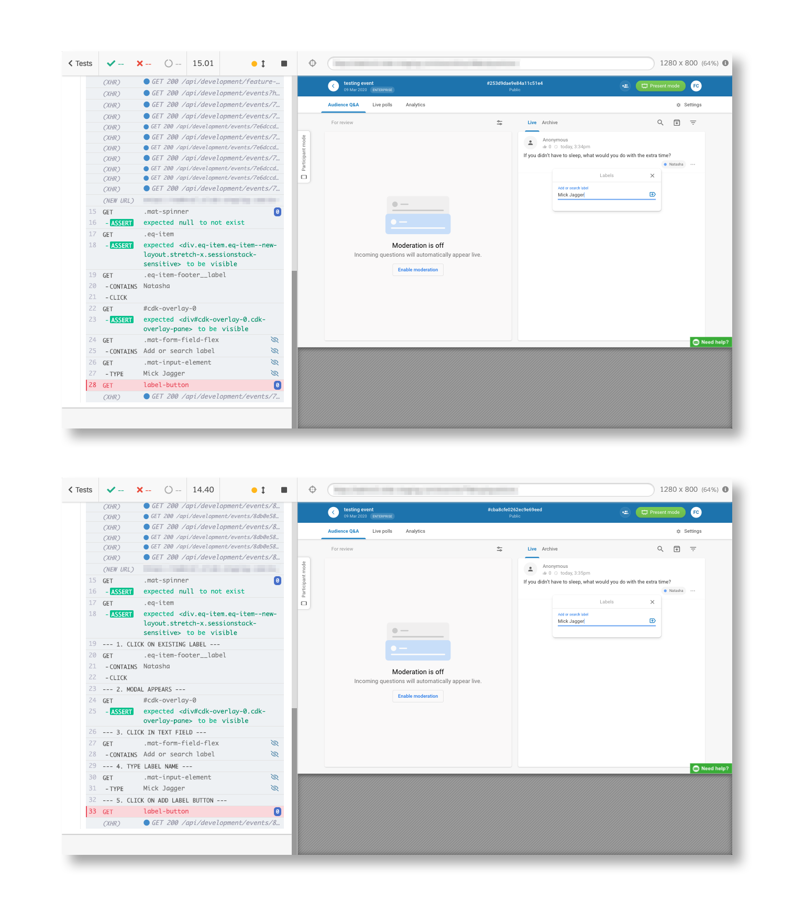
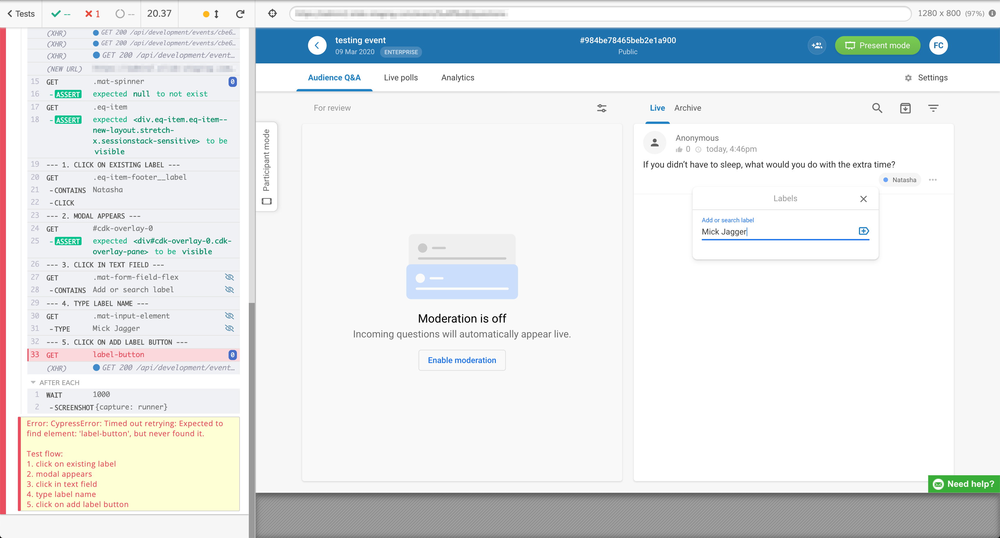

Cypress makes it incredibly easy to read their code. Even people that don’t work with Cypress here at Slido can easily understand what is going on in the test code.

That’s why I overlooked the **cy.log()** command. It seemed kind of arbitrary and didn’t make too much sense to add extra log into what is already pretty readable flow. Cypress pretty much nailed it when it comes to readability of code. Not only that, readability of test reports is amazing as well.

When working with headless mode, you can actually see what your test does, since Cypress records video for your headless runs. If you need to examine a failed run, you can easily look into what your test did before it failed.
>Extra tip: Did you know, you may choose the option to upload video only on failed runs? Save some extra seconds by adding `videoUploadOnPasses: false` to your cypress.json config file.

Situation changes rapidly as your test suite grows. With over 1000 tests here in Slido we sometimes face a situation where we sometimes have to look into failures of multiple tests. It takes slightly more time to look into video than to look on a screenshot. Although video shows the whole test run, screenshots can be more efficient if done properly. I don’t know about you, but I’d rather go through 10 screenshots than through 10 videos to find out why a test failed.

But - on an error screenshot, you are limited to screenshot height so you probably see only a couple of commands. This is where I found out cy.log() might be handy. With cy.log() I can caption my screenshots, and give more context to what the test was doing before it failed. I started adding cy.log() commands to each step of my test, to describe action that is being executed.

Then, I added a few tweaks into this.

1. I rewrote the command to add triple dash in front and at the end of the message, to make my logs pop out. Basically to guide my eyes better (yes, I know [some psychology](https://medium.com/slido-dev-blog/what-psychology-taught-me-about-qa-eeecbe054cc1))
2. I added a counter, so that every log has a number and I can get a grasp of where the test failed

The result looks like this:


*Upper screenshots is without logs, lower screenshot shows log on each step.*

Adding this was in fact quite easy. I added this piece of code to my support/index.js file:

```javascript
beforeEach( function() {
  window.logCalls = 1;
});

Cypress.Commands.overwrite('log', (originalFn, message) => {

  Cypress.log({
    displayName: `--- ${window.logCalls}. ${message} ---`,
    name: `--- ${window.logCalls}. ${message} ---`,
    message: ''
  });

  window.logCalls++;

});
```
While writing this blog, I realized, that these logs can be further used for creating better error logs. Each of these steps can be added to error message, which would look something like this:



Basically we are just creating an empty array that we are going to output as a part of error message when a test fails.

```javascript
beforeEach( function() {
  window.logCalls = 1;
  window.testFlow = [];
});

Cypress.Commands.overwrite('log', (originalFn, message) => {

  Cypress.log({
    displayName: `--- ${window.logCalls}. ${message} ---`,
    name: `--- ${window.logCalls}. ${message} ---`,
    message: ''
  });

  window.testFlow.push(`${window.logCalls}. ${message}`);
  window.logCalls++;

});

Cypress.on('fail', (error) => {

  throw new Error(error + '\n\nTest flow:\n' + window.testFlow.join('\n'));

});
```

These error messages are written out to Cypress dashboard, so if you caption them right, boom! Instant error scenario! There goes a JIRA ticket 😆

>EDIT: Since I wrote this post, Cypress was updated to version 4.6.0 which pretty much blew my mind. Error messages can now guide you straight to your editor, to the exact place where your test failed. However, implementing `Cypress.on('fail')` magic that I mention at the end of this article obstructs this from these new features to work properly. For me, personally the new error messages are worth more, so I’m no longer using this hack and I advice you to consider too 🙂